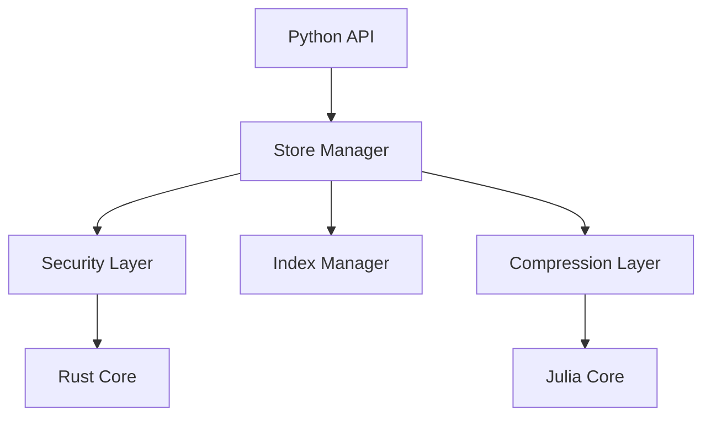

<p align="center">
  
</p>

<h1 align="center">PromptVeil</h1>

> **tl;dr:** An open-source framework that lets you store, compress, and query LLM conversations with hardware-accelerated security and token-aware compression. From single files to distributed storage, from personal storage to enterprise data lakes.

<h3 align="center">Open Source Framework for LLM Conversation Management</h3>

<p align="center">
  <strong>A comprehensive framework for secure, efficient storage and retrieval of AI conversations</strong>
</p>

<p align="center">
  <a href="https://opensource.org/licenses/MIT"></a>
  <a href="https://www.python.org/downloads/"></a>
  <a href="https://github.com/yourusername/promptveil"></a>
  <a href="docs/SECURITY.md"></a>
  <a href="docs/ARCHITECTURE.md"></a>
  <a href="docs/CONTRIBUTING.md"></a>
</p>

<p align="center">
  <a href="#framework-overview">Framework Overview</a> •
  <a href="#key-features">Key Features</a> •
  <a href="#quick-start">Quick Start</a> •
  <a href="#architecture">Architecture</a> •
  <a href="#contributing">Contributing</a>
</p>

# Framework Overview

PromptVeil is an open-source framework designed to solve the challenges of storing, managing, and retrieving LLM conversations at any scale. It combines:

- **High-Performance Core**: Julia-powered compression engine with SIMD/GPU acceleration
- **Security Layer**: Rust-based encryption with hardware acceleration
- **Search System**: TF-IDF based search with phrase matching and role filtering
- **Python Interface**: Simple yet powerful API for developers

### Design Philosophy

- 🔒 **Security First**: Hardware-accelerated encryption, secure key management
- 🚀 **High Performance**: GPU-accelerated compression, parallel processing
- 🔍 **Smart Search**: Advanced indexing with relevance ranking
- 🎯 **Production Ready**: Battle-tested in enterprise environments

## Technical Details

### Security Implementation
We use industry-standard cryptographic primitives with careful consideration:

- **Encryption**: AES-GCM with hardware acceleration
  - 256-bit keys for maximum security
  - Secure key management with rotation
  - Memory protection and secure cleanup
  - Detailed security considerations in [SECURITY.md](docs/SECURITY.md)

### Search and Indexing
- **Advanced Search Features**:
  - TF-IDF based relevance scoring
  - Phrase matching support
  - Role-based filtering
  - Recency-aware ranking
  - See [INDEXING.md](docs/INDEXING.md) for details

### Compression Engine
- **Token-Aware Compression**: Custom Julia algorithms optimized for LLM data
- **Hardware Acceleration**: 
  - SIMD vectorization for CPU efficiency
  - CUDA support for GPU acceleration
  - Automatic performance scaling
  - See [COMPRESSION.md](docs/COMPRESSION.md) for details

### Storage Format (.pveil)
Our binary format is designed for:
- Efficient random access
- Parallel processing support
- Metadata preservation
- Version compatibility
See [FORMAT.md](docs/FORMAT.md) for specifications.

## Quick Start

```python
from promptveil import ConversationStore, Conversation

# Create a store for managing conversations
store = ConversationStore()

# Add conversations
conv = Conversation()
conv.add_message("user", "What is quantum computing?")
conv.add_message("assistant", "Quantum computing leverages quantum phenomena...")
conv_id = store.add_conversation(conv)

# Search conversations
results = store.search("quantum computing")
for result in results:
    print(f"Score: {result.score}, Snippet: {result.snippet}")

# Save store securely
store.save("conversations.pveil")
```

## Roadmap

### Current Release (0.1.0)
- ✅ Core architecture setup
- ✅ Basic conversation management
- ✅ Initial file storage
- ✅ Basic security layer

### Next Release (0.2.0)
- 🔄 High-performance compression engine
- 🔄 Hardware-accelerated security
- 🔄 Text and semantic search
- 🔄 Conversation store with analytics

### Future Releases (1.0.0)
- 📅 Topic extraction and analysis
- 📅 Export to common formats
- 📅 Sharing and collaboration features
- 📅 Version control and history
- 📅 Quality metrics and insights
- 📅 Training data preparation
- 📅 Cloud storage integration

## Getting Involved

We're actively developing PromptVeil and welcome contributions! Here's how you can help:

### Current Focus Areas
1. **Search Implementation**
   - Text search in conversations
   - Semantic search capabilities
   - Topic extraction algorithms

2. **Analytics Development**
   - Conversation statistics
   - Topic analysis
   - Performance metrics

3. **Documentation and Examples**
   - Usage examples
   - Integration guides
   - Performance benchmarks

See our [Contributing Guide](docs/CONTRIBUTING.md) for details on how to get started.

## Architecture



For detailed architecture documentation, see:
- [ARCHITECTURE.md](docs/ARCHITECTURE.md) - System overview
- [SECURITY.md](docs/SECURITY.md) - Security implementation
- [INDEXING.md](docs/INDEXING.md) - Search system
- [COMPRESSION.md](docs/COMPRESSION.md) - Compression engine
- [FORMAT.md](docs/FORMAT.md) - File format
- [PYTHON_API.md](docs/PYTHON_API.md) - API reference

## Performance

| Operation | Performance | Notes |
|-----------|------------|--------|
| Compression | Up to 90% | Token-aware, content-dependent |
| Encryption | ~1GB/s | Hardware-accelerated |
| Search | <100ms | For typical conversation stores |
| GPU Speedup | 5-10x | When available |

## Framework Extensions

- **Cloud Integration**: Native support for major cloud providers
- **Analytics Tools**: Built-in conversation analysis
- **Training Pipeline**: Export conversations for model fine-tuning
- **Custom Backends**: Plug in your own storage solution

## Contributing

We welcome contributions! Our framework is designed to be extensible:

- **Core Components**: Julia/Rust implementations
- **Language Bindings**: Beyond Python
- **Storage Backends**: New implementations
- **Security Audits**: Help us stay secure

See [CONTRIBUTING.md](docs/CONTRIBUTING.md) for guidelines.

## Community

- [Technical Blog](https://blog.promptveil.dev)
- [Discord Server](https://discord.gg/promptveil)
- [GitHub Discussions](https://github.com/yourusername/promptveil/discussions)

## License

MIT License - See [LICENSE](LICENSE)

## Acknowledgments

- Julia Community for compression insights
- Rust Security Team for cryptographic guidance
- Our amazing contributors

---

<p align="center">Built with ❤️ by developers, for developers</p>
