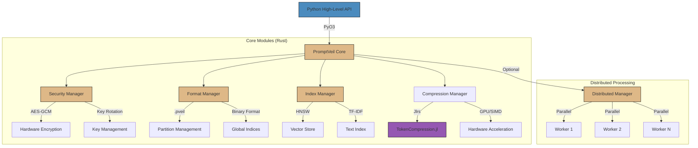

<p align="center">
  
</p>

<h1 align="center">PromptVeil</h1>

<h2 align="center">🚧 COMING SOON! 🚧</h2>
<p align="center">
  <strong>This repository is under active development and will be officially launched soon.<br>
  Star and watch the repo to get notified when we launch!</strong>
</p>

> **tl;dr:** An open-source framework that lets you store, compress, and query LLM conversations with hardware-accelerated security and token-aware compression. From single files to distributed storage, from personal storage to enterprise data lakes.

<h3 align="center">Open Source Framework for LLM Conversation Management</h3>

<p align="center">
  <strong>A comprehensive framework for secure, efficient storage, and retrieval of AI conversations</strong>
</p>

<p align="center">
  <a href="https://opensource.org/licenses/MIT"></a>
  <a href="https://www.python.org/downloads/"></a>
  <!-- Build status badge removed since CI not set up yet -->
  <!-- PyPI version badge removed since package not published yet -->
  <a href="https://github.com/PromptVeil/PromptVeil"></a>
  <!-- Documentation badge removed since docs not available yet -->
  <a href="docs/CONTRIBUTING.md"></a>
</p>

<p align="center">
  <a href="#framework-overview">Framework Overview</a> •
  <a href="#key-features">Key Features</a> •
  <a href="#quick-start">Quick Start</a> •
  <a href="#architecture">Architecture</a> •
  <a href="#contributing">Contributing</a>
</p>

# Framework Overview

PromptVeil is an open-source framework designed to solve the challenges of storing, managing, and retrieving LLM conversations at any scale. It combines:

- **High-Performance Core**: Julia-powered compression engine with SIMD/GPU acceleration
- **Security Layer**: Rust-based encryption with hardware acceleration
- **Advanced Search System**: Efficient retrieval with TF-IDF based search, phrase matching, and role filtering
- **Python Interface**: Simple yet powerful API for developers

### Design Philosophy

- 🔒 **Security First**: Hardware-accelerated encryption, secure key management
- 🚀 **High Performance**: GPU-accelerated compression, parallel processing
- 🔍 **Smart and Efficient Search**: Advanced indexing with relevance ranking and efficient retrieval
- 🎯 **Production Ready**: Designed with enterprise-grade standards in mind

## Technical Details

### Security Implementation
We use industry-standard cryptographic primitives with careful consideration:

- **Encryption**: AES-GCM with hardware acceleration
  - 256-bit keys for maximum security
  - Secure key management with rotation
  - Memory protection and secure cleanup
  - Detailed security considerations in [SECURITY.md](docs/SECURITY.md)

### Search and Indexing
- **Advanced Search Features**:
  - TF-IDF based relevance scoring
  - Phrase matching support
  - Role-based filtering
  - Recency-aware ranking
  - Efficient retrieval through optimized indexing
  - See [INDEXING.md](docs/INDEXING.md) for details

## Innovation in Compression
PromptVeil introduces a novel approach to LLM conversation compression:

- **Two-Stage Compression**: Works with any tokenizer's output to provide additional compression
- **Conversation-Aware**: Specialized algorithms that understand and optimize for dialogue patterns
- **Hardware Acceleration**: Leverages GPU and SIMD for high-performance compression
- **Adaptive Learning**: Improves compression ratios by learning from conversation structures

Performance Metrics:
- 25-50% average size reduction
- Up to 75% for repetitive dialogue patterns
- Hardware-accelerated processing
- Maintains conversation structure integrity

### Storage Format (.pveil)
Our binary format is designed for:
- Efficient random access
- Parallel processing support
- Metadata preservation
- Version compatibility
See [FORMAT.md](docs/FORMAT.md) for specifications.

## Quick Start

```python
from promptveil import PromptVeil, SearchConfig

# Initialize PromptVeil
pv = PromptVeil()

# Add a conversation
conversation = [
    {"role": "user", "content": "What is quantum computing?"},
    {"role": "assistant", "content": "Quantum computing leverages quantum phenomena..."}
]
pv.add_conversation(conversation)

# Basic search
results = pv.search("quantum computing")

# Advanced hybrid search
search_config = SearchConfig(
    query="quantum computing",
    search_type="hybrid",  # Options: "text", "vector", "hybrid"
    weights={
        "text": 0.7,      # Weight for text-based search
        "vector": 0.3     # Weight for vector similarity
    },
    filters={
        "role": "assistant",
        "timestamp": {"after": "2024-01-01"}
    },
    limit=10
)

results = pv.search(search_config)

# Process results
for result in results:
    print(f"Score: {result.score}")
    print(f"Text Match Score: {result.text_score}")
    print(f"Vector Similarity: {result.vector_score}")
    print(f"Content: {result.content}")
    print(f"Highlights: {result.highlights}")  # Matched text segments
```

## Roadmap

### Current Release (0.1.0)
- ✅ Core architecture setup
- ✅ Basic conversation management
- ✅ Initial file storage
- ✅ Basic security layer

### Next Release (0.2.0)
- 🔄 High-performance compression engine
- 🔄 Hardware-accelerated security
- 🔄 Text and semantic search
- 🔄 Conversation store with analytics

### Future Releases (1.0.0)
- 📅 Topic extraction and analysis
- 📅 Export to common formats
- 📅 Sharing and collaboration features
- 📅 Version control and history
- 📅 Quality metrics and insights
- 📅 Training data preparation
- 📅 Cloud storage integration

## Getting Involved

We're actively developing PromptVeil and welcome contributions! Here's how you can help:

### Current Focus Areas
1. **Search Implementation**
   - Text search in conversations
   - Semantic search capabilities
   - Topic extraction algorithms

2. **Analytics Development**
   - Conversation statistics
   - Topic analysis
   - Performance metrics

3. **Documentation and Examples**
   - Usage examples
   - Integration guides
   - Performance benchmarks

See our [Contributing Guide](docs/CONTRIBUTING.md) for details on how to get started.

## Architecture



### Core Components

1. **Security Manager (Rust)**
   - Hardware-accelerated AES-GCM encryption
   - Secure key management and rotation
   - Memory protection

2. **Format Manager (Rust)**
   - .pveil binary format handling
   - Partition management
   - Global indices maintenance

3. **Index Manager (Rust)**
   - Vector-based similarity search
   - Text-based search with TF-IDF
   - Real-time index updates
   - Efficient retrieval mechanisms

4. **Compression Manager (Rust + Julia)**
   - Integration with TokenCompression.jl
   - GPU/SIMD acceleration
   - Batch processing optimization

5. **Distributed Processing (Optional)**
   - Automatic partitioning
   - Parallel processing
   - Result merging

### Python Integration

Simple high-level API for end users:

```python
from promptveil import PromptVeil

# Initialize with optional distributed processing
pv = PromptVeil(distributed=True, workers=4)

# Save conversations (automatically handles compression, encryption, and indexing)
pv.save_conversation([
    {"role": "user", "content": "What is quantum computing?"},
    {"role": "assistant", "content": "Quantum computing leverages..."}
])

# Search with automatic vector/text hybrid search
results = pv.search("quantum computing")
```

## Performance

| Operation | Performance | Notes |
|-----------|------------|--------|
| Compression | TBD | Token-aware, content-dependent |
| Encryption | TBD | Hardware-accelerated |
| Search | TBD | For typical conversation stores |
| GPU Speedup | TBD | When available |

## Framework Extensions

- **Cloud Integration**: Native support for major cloud providers
- **Analytics Tools**: Built-in conversation analysis
- **Training Pipeline**: Export conversations for model fine-tuning
- **Custom Backends**: Plug in your own storage solution

## Contributing

We welcome contributions! Our framework is designed to be extensible:

- **Core Components**: Julia/Rust implementations
- **Language Bindings**: Beyond Python
- **Storage Backends**: New implementations
- **Security Audits**: Help us stay secure

See [CONTRIBUTING.md](docs/CONTRIBUTING.md) for guidelines.

## Community

- Technical Blog (Coming Soon)
- Discord Server (Coming Soon) 
- GitHub Discussions (Coming Soon)

## License

MIT License - See [LICENSE](LICENSE)
