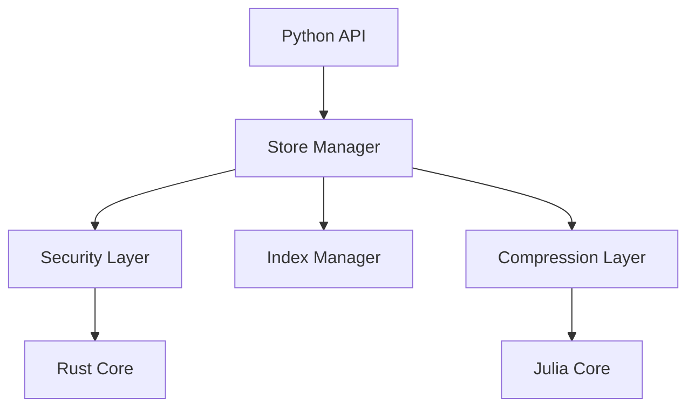

# PromptVeil Architecture

## Core Components

PromptVeil is built with a layered architecture focusing on security, efficiency, and usability:

1. **Core Layer** - Julia and Rust components for performance-critical operations
   - [TokenCompression.jl](https://github.com/yourusername/TokenCompression.jl) for optimized token compression
   - Rust security layer for encryption and key management (see [SECURITY.md](SECURITY.md))

2. **Python Layer** - High-level interface and business logic
   - Conversation management
   - Search and indexing (see [INDEXING.md](INDEXING.md))
   - File format handling

## Security

Security is a fundamental aspect of PromptVeil. For detailed information about our security implementation, including encryption, key management, and best practices, see [SECURITY.md](SECURITY.md).

Key security features:
- AES-GCM encryption
- Hardware-accelerated operations
- Secure key management
- Memory protection

## Search and Indexing

PromptVeil provides powerful search capabilities through its indexing system. For detailed information about search features, ranking algorithms, and optimization techniques, see [INDEXING.md](INDEXING.md).

Key indexing features:
- TF-IDF based relevance
- Phrase matching
- Role-based filtering
- Recency-aware ranking

## File Format

The `.pveil` format is designed for secure and efficient storage. See [FORMAT.md](FORMAT.md) for detailed specifications.

## Performance

Performance optimization happens at multiple levels:
1. Julia for numerical operations
2. Rust for system-level operations
3. Efficient Python implementations
4. Memory-conscious data structures

## Error Handling

Comprehensive error handling across all layers:
1. Specific exception types
2. Secure error messages
3. Automatic resource cleanup
4. Validation at boundaries

## Best Practices

1. Security-first development
2. Performance monitoring
3. Memory management
4. Error handling
5. Documentation

## Component Dependencies

## Future Development

1. Enhanced compression algorithms
2. Additional security features
3. Advanced search capabilities
4. Performance optimizations 