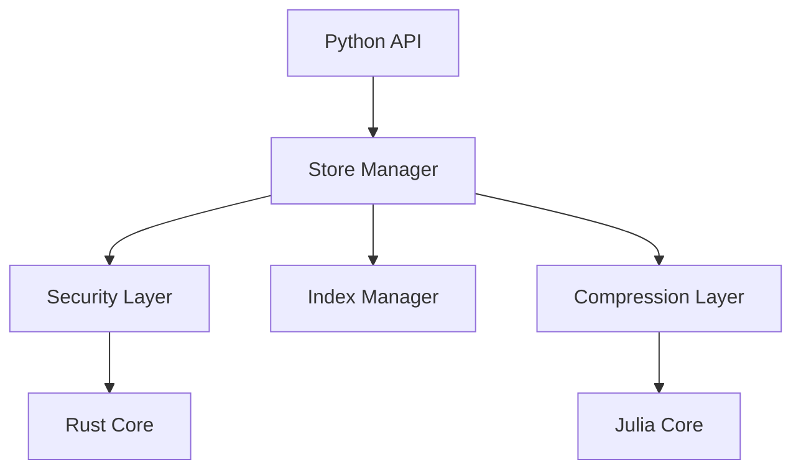

# PromptVeil Architecture

## Overview

PromptVeil follows a modular architecture with clear separation of concerns:

```
[Python High-Level API] --> [Rust Core Modules] --> [Hardware Acceleration]
```

## Core Components

### 1. Rust Core (promptveil_core)

Central integration point for all core functionality:

```rust
pub struct PromptVeilCore {
    security: SecurityManager,
    format: PveilManager,
    index: IndexManager,
    compression: CompressionManager,
}
```

#### Security Manager
- Hardware-accelerated encryption (AES-GCM)
- Key management and rotation
- Memory protection
- See [SECURITY.md](SECURITY.md) for details

#### Format Manager
- .pveil binary format handling
- Partition management
- Global and local indices
- See [FORMAT.md](FORMAT.md) for details

#### Index Manager
- Vector similarity search (HNSW)
- Text search (TF-IDF)
- Real-time indexing
- See [INDEXING.md](INDEXING.md) for details

#### Compression Manager
- Integration with TokenCompression.jl
- GPU/SIMD acceleration
- Batch processing
- See [COMPRESSION.md](COMPRESSION.md) for details

### 2. Distributed Processing

Optional component for scaling:

```rust
pub struct DistributedManager {
    workers: Vec<Worker>,
    config: DistributedConfig,
}

pub struct Worker {
    compression: CompressionManager,
    security: SecurityManager,
    index: IndexManager,
}
```

Features:
- Automatic partitioning
- Parallel processing
- Result merging
- Load balancing

### 3. Python Integration

Single high-level API for end users:

```python
class PromptVeil:
    def __init__(self, distributed: bool = False, workers: int = 1):
        """Initialize PromptVeil with optional distributed processing."""
        
    def save_conversation(self, messages: List[Dict[str, str]]):
        """Save a conversation with automatic processing."""
        
    def search(self, query: str) -> List[SearchResult]:
        """Search conversations using hybrid search."""
        
    def find_similar(self, text: str) -> List[SearchResult]:
        """Find similar conversations using vector search."""
```

## Data Flow

1. **Input Processing**
   ```
   Raw Conversation
   → Tokenization
   → Compression (TokenCompression.jl)
   → Encryption (AES-GCM)
   → .pveil Format
   → Index Updates
   → Storage
   ```

2. **Search Processing**
   ```
   Search Query
   → Vector Embedding
   → Parallel Search
     → Vector Similarity (HNSW)
     → Text Search (TF-IDF)
   → Result Merging
   → Response
   ```

## Hardware Acceleration

1. **Compression**
   - GPU acceleration via CUDA
   - SIMD optimization
   - Batch processing

2. **Encryption**
   - AES-NI instructions
   - Hardware random number generation
   - Secure key storage

3. **Search**
   - GPU-accelerated vector search
   - Parallel text search
   - Distributed processing

## Implementation Details

### Core Module Integration

```rust
// Core integration point
impl PromptVeilCore {
    pub fn process_conversation(&self, conv: Conversation) -> Result<()> {
        // 1. Compress
        let compressed = self.compression.compress_batch(&conv.tokens)?;
        
        // 2. Encrypt
        let encrypted = self.security.encrypt(&compressed)?;
        
        // 3. Format
        let pveil_data = self.format.create_partition(encrypted)?;
        
        // 4. Index
        self.index.update_indices(&pveil_data)?;
        
        Ok(())
    }
}
```

### Distributed Processing

```rust
impl DistributedManager {
    pub fn process_batch(&self, conversations: Vec<Conversation>) -> Result<()> {
        // 1. Partition data
        let partitions = self.create_partitions(conversations);
        
        // 2. Distribute to workers
        let results = self.workers.par_iter()
            .map(|worker| worker.process_partition(partition))
            .collect();
            
        // 3. Merge results
        self.merge_results(results)
    }
}
```

## Future Considerations

1. **Scaling**
   - Distributed index sharding
   - Streaming processing
   - Cloud integration

2. **Performance**
   - Custom GPU kernels
   - Optimized memory management
   - Advanced caching

3. **Features**
   - Real-time processing
   - Custom backends
   - Plugin system

## Security

Security is a fundamental aspect of PromptVeil. For detailed information about our security implementation, including encryption, key management, and best practices, see [SECURITY.md](SECURITY.md).

Key security features:
- AES-GCM encryption
- Hardware-accelerated operations
- Secure key management
- Memory protection

## Search and Indexing

PromptVeil provides powerful search capabilities through its indexing system. For detailed information about search features, ranking algorithms, and optimization techniques, see [INDEXING.md](INDEXING.md).

Key indexing features:
- TF-IDF based relevance
- Phrase matching
- Role-based filtering
- Recency-aware ranking

## File Format

The `.pveil` format is designed for secure and efficient storage. See [FORMAT.md](FORMAT.md) for detailed specifications.

## Performance

Performance optimization happens at multiple levels:
1. Julia for numerical operations
2. Rust for system-level operations
3. Efficient Python implementations
4. Memory-conscious data structures

## Error Handling

Comprehensive error handling across all layers:
1. Specific exception types
2. Secure error messages
3. Automatic resource cleanup
4. Validation at boundaries

## Best Practices

1. Security-first development
2. Performance monitoring
3. Memory management
4. Error handling
5. Documentation

## Component Dependencies



## Future Development

1. Enhanced compression algorithms
2. Additional security features
3. Advanced search capabilities
4. Performance optimizations 